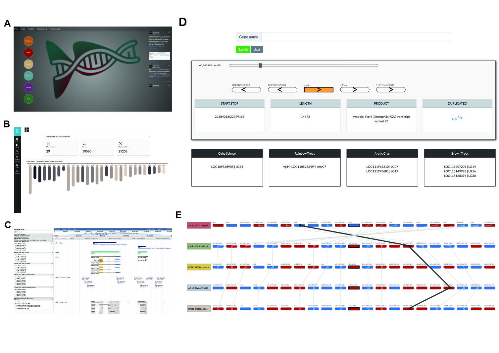

#### Salmobase: an integrative omics data resource for salmonids centred on genome organization  and evolution  
---
I am developing salmobase2 (https://salmobase.org/) as part of the ELIXIR Norway services. Currently salmobase is down due to server update. It will again up and running soon

The project is hosted here https://gitlab.com/elixir-nmbu/salmobase2 

Here are some of the webpages and utilities you can find when visiting salmobase.org

- (A) Landing page of salmobase.org
- (B) Dashbord showing the different chromosomes of each salmonid species hosted in salmobase.org
- (C) Genome browser (JBrowse)
- (D) Gene finder implementing autocomplete search functionality. Users must entry at least 3 letters. 
- (E) Built-in synteny viewer.
   
